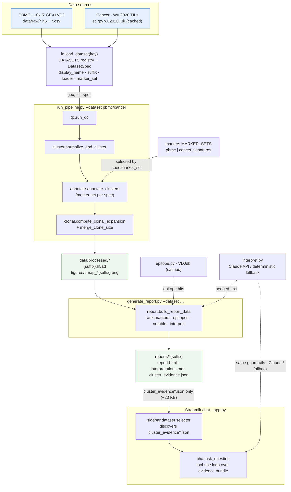

# Clonal Compass — architecture

Data flows one direction: both datasets converge on a single loader/registry,
run through the *same* dataset-agnostic pipeline (a filename `suffix` keeps their
outputs side by side), and the Streamlit chat reads only the compact ~20 KB
evidence bundle — never the multi-hundred-MB `.h5ad` objects.

## How to read it

- **Two datasets, one path.** `PBMC` and `Cancer` both resolve through
  `io.load_dataset` into a single `DatasetSpec`; the pipeline stages
  (`qc → cluster → annotate → clonal`) are identical for both. The spec's
  `suffix` (`""` for PBMC, `_cancer` for cancer) is what keeps their processed
  objects, figures, and reports coexisting on disk.
- **Marker set is injected, not branched.** `annotate.annotate_clusters` scores
  whichever `markers.MARKER_SETS[spec.marker_set]` the dataset selects — the
  labelling logic itself is unchanged and dataset-agnostic.
- **The chat is bundle-only.** `app.py` discovers the per-dataset
  `cluster_evidence*.json` bundles, lets the user pick one, and answers grounded
  in that ~20 KB JSON via `chat.ask_question`'s tool-use loop. It never opens the
  `.h5ad` objects.
- **Solid arrows** are data written/read; **dotted arrows** are cross-cutting
  helpers (marker signatures, VDJdb epitopes, the Claude/​fallback interpretation
  layer with its shared guardrails).

> Rendered by any Mermaid-aware viewer (GitHub, VS Code, mermaid.live). To export
> an image: `mmdc -i docs/architecture.md -o docs/architecture.svg` (needs
> `@mermaid-js/mermaid-cli`).
